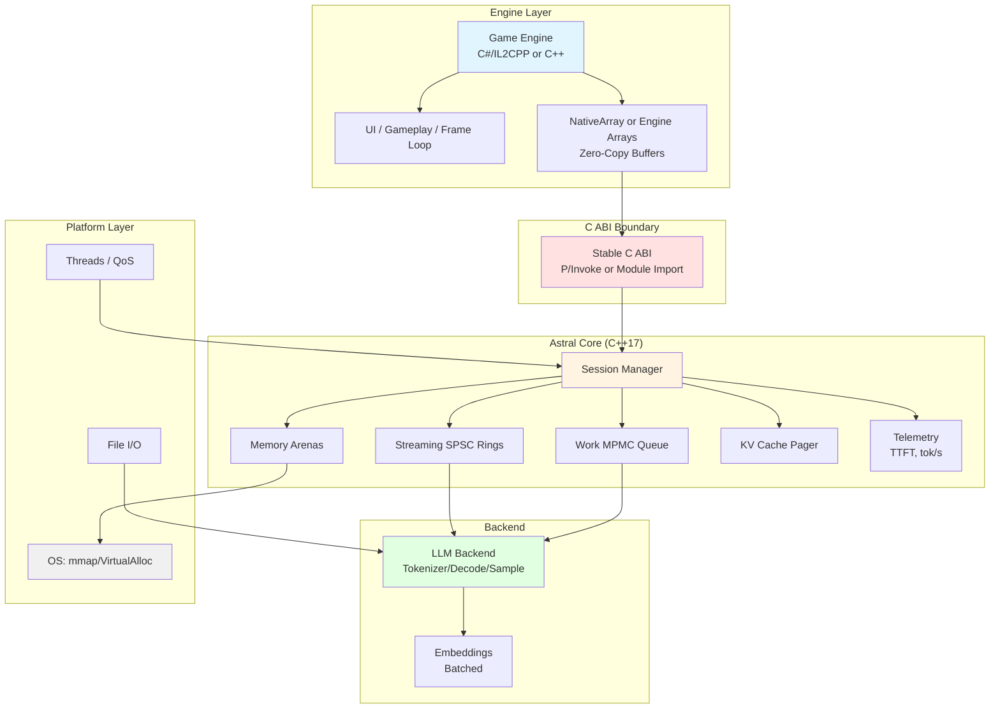
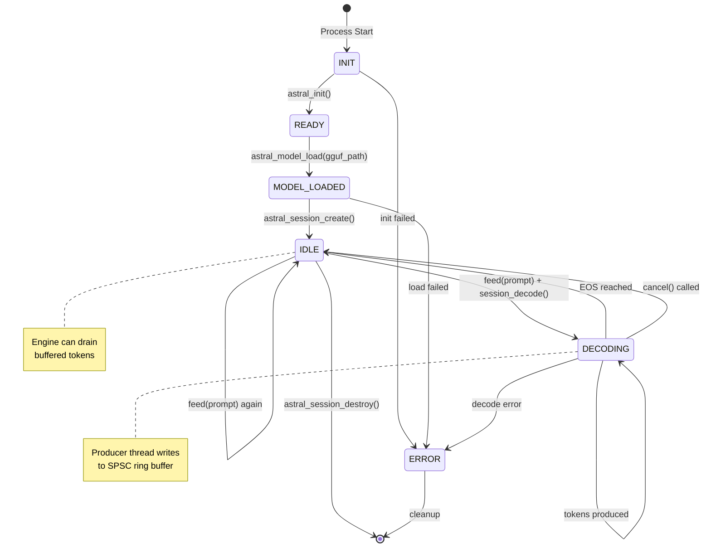
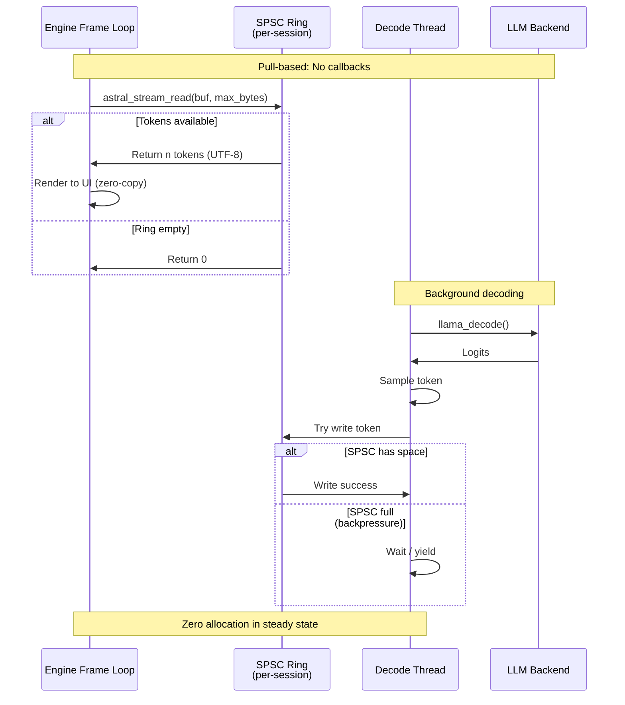
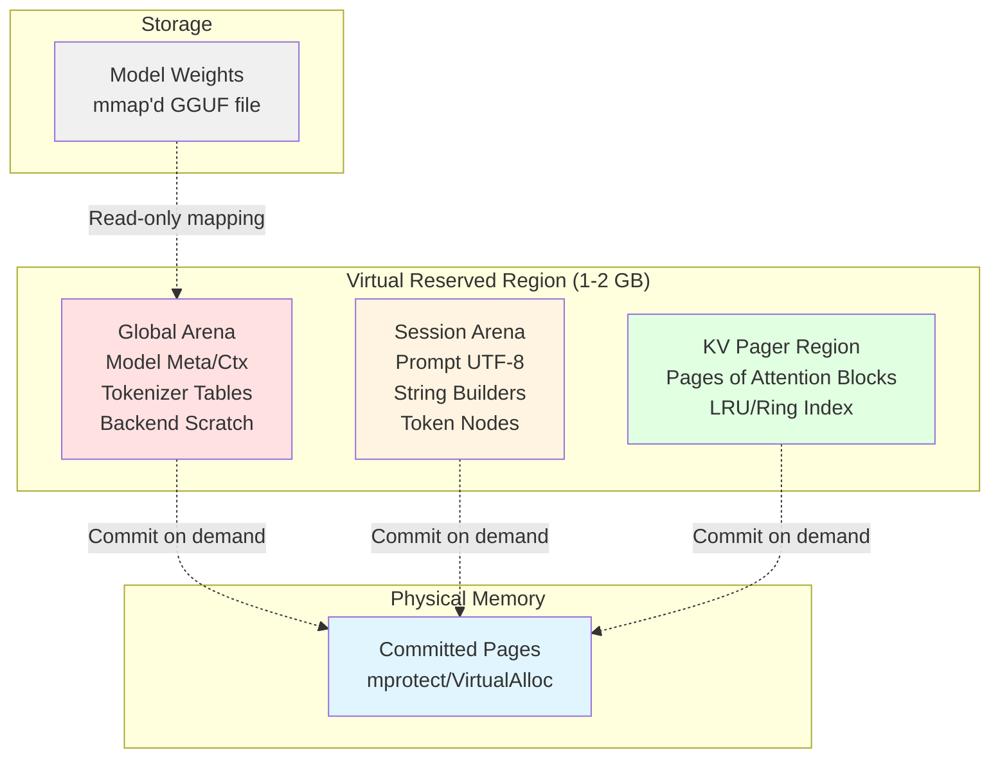
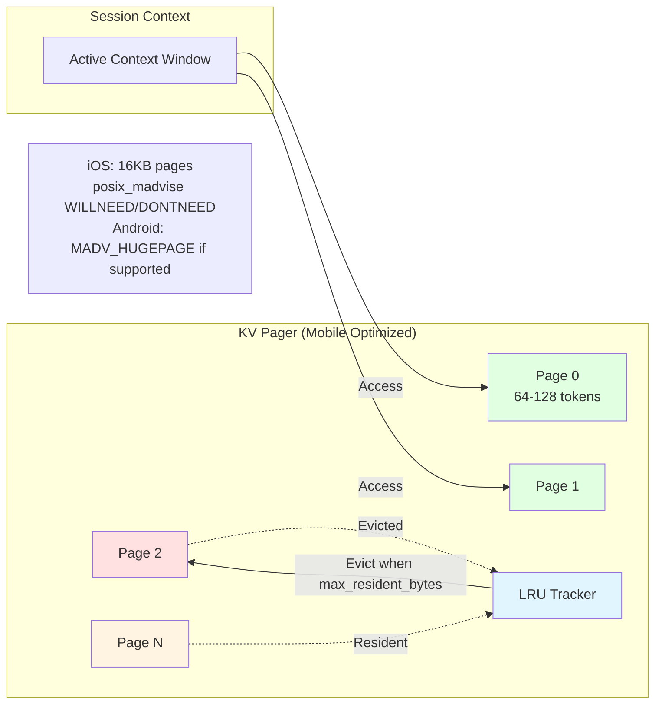
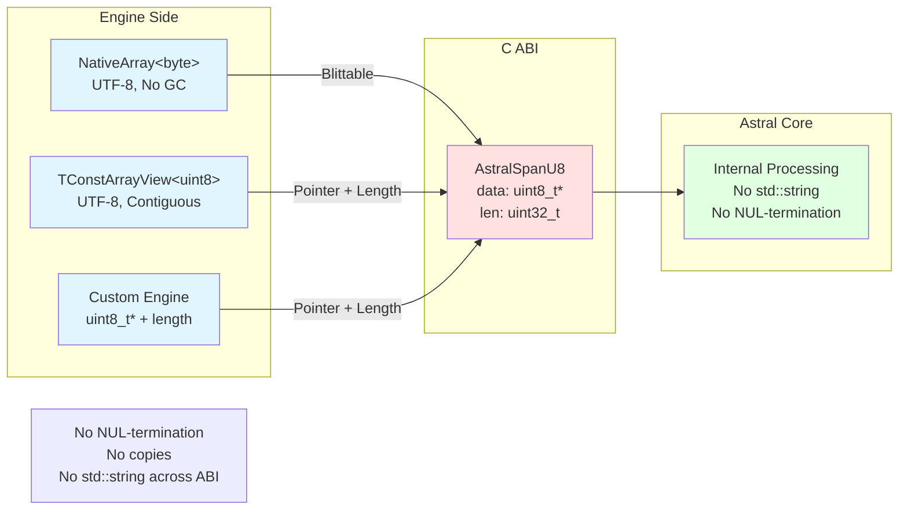

# Game Engine Integration Patterns

## Overview

This document outlines patterns and best practices for integrating Astral with **game engines** through a stable C ABI, memory management adapters, async task integration, and zero-copy streaming patterns.

## High-Level Stack Architecture



## Session State Machine



## Streaming Pipeline (Pull-Based)



## Concurrency Core Architecture

```mermaid
graph TB
    subgraph "Job Submission"
        APP1[Application Thread 1]
        APP2[Application Thread 2]
        APPN[Application Thread N]
    end

    subgraph "MPMC Work Queue"
        MPMC[MPMC Ring<br/>Bounded, Power-of-2]
    end

    subgraph "Worker Threads"
        W0[Decode Thread 0]
        W1[Decode Thread 1]
        WN[Decode Thread N]
    end

    subgraph "Per-Session Output"
        SPSC0[SPSC Ring<br/>Session 0]
        SPSC1[SPSC Ring<br/>Session 1]
    end

    APP1 -->|session_feed()| MPMC
    APP2 -->|embed_enqueue()| MPMC
    APPN -->|session_decode()| MPMC

    MPMC -->|Fetch job| W0
    MPMC -->|Fetch job| W1
    MPMC -->|Fetch job| WN

    W0 -->|Write tokens| SPSC0
    W1 -->|Write tokens| SPSC1

    APP1 -.Read tokens.-> SPSC0
    APP2 -.Read tokens.-> SPSC1

    style MPMC fill:#ffe1e1
    style SPSC0 fill:#e1ffe1
    style SPSC1 fill:#e1ffe1
```

## Memory Layout (Virtual Reserve + Arenas)



## KV Cache Paging



## Engine String/Buffer Rules (Zero-Copy)



## Core Philosophy

1. **Stable C ABI**: Never break ABI compatibility within major version
2. **Zero-Copy Streaming**: Pull-based token consumption with pre-allocated buffers
3. **Engine Allocator Preferred**: Use engine's memory tracking and allocation systems
4. **No Callbacks**: Avoid callback-based APIs that block or require marshaling
5. **Bounded Queues**: All queues have fixed capacity for predictable memory usage

## C ABI Design

### Memory Management Interface

```cpp
// engine_allocator.h
#pragma once

#ifdef __cplusplus
extern "C" {
#endif

// Allocator function pointers (blittable across C ABI)
typedef void* (*AstralAllocFn)(void* ctx, size_t size, size_t align);
typedef void  (*AstralFreeFn)(void* ctx, void* ptr, size_t size, size_t align);

// Allocator descriptor
typedef struct AstralAllocator {
  AstralAllocFn alloc;
  AstralFreeFn  free;
  void*         context;  // User-provided context (e.g., Unity allocator handle)
} AstralAllocator;

// Example: Unity allocator bridge
// C# side:
// [UnmanagedFunctionPointer(CallingConvention.Cdecl)]
// public delegate IntPtr AllocFn(IntPtr ctx, UIntPtr size, UIntPtr align);
//
// static IntPtr UnityAlloc(IntPtr ctx, UIntPtr size, UIntPtr align) {
//   var array = new NativeArray<byte>((int)size, Allocator.Persistent);
//   return (IntPtr)array.GetUnsafePtr();
// }

#ifdef __cplusplus
}
#endif
```

### Span-Based String Interface

```c
#include "astral_rt.h"

// AstralSpanU8 / AstralMutSpanU8 are UTF-8 spans (pointer + length).
// On 64-bit ABIs they are 16 bytes (explicit padding) to keep layouts stable across languages.

// Example: Feed prompt from Unity
// C# side:
// using var prompt = new NativeArray<byte>(Encoding.UTF8.GetBytes("Hello"), Allocator.Temp);
// AstralSpanU8 span = new AstralSpanU8 {
//   data = (byte*)prompt.GetUnsafeReadOnlyPtr(),
//   len = (uint)prompt.Length
// };
// astral_session_feed(session, span, 1);

```

### Core Session API

```c
#include "astral_rt.h"

// Notes:
// - AstralHandle is a 64-bit tagged handle (0 = invalid).
// - UTF-8 strings are spans (pointer + length); no NUL terminator assumed.

AstralErr astral_init(const AstralInit* cfg);
void astral_shutdown(void);

AstralErr astral_model_load(const AstralModelDesc* desc, AstralHandle* out_model);
void astral_model_release(AstralHandle model);

AstralErr astral_session_create(const AstralSessionDesc* desc, AstralHandle* out_session);
void astral_session_destroy(AstralHandle session);

AstralErr astral_session_feed(AstralHandle session, AstralSpanU8 prompt_chunk, uint8_t finalize);
AstralErr astral_session_decode(AstralHandle session);

AstralErr astral_session_cancel(AstralHandle session);
AstralErr astral_session_wait(AstralHandle session, uint32_t timeout_ms);
AstralErr astral_session_reset(AstralHandle session, const AstralSessionDesc* desc); // desc optional

// Pull-based streaming:
// - returns >0 bytes for one token piece
// - returns 0 at end-of-stream
// - returns ASTRAL_E_TIMEOUT if no data before timeout
int32_t astral_stream_read(AstralHandle session, AstralMutSpanU8 out_buf, uint32_t timeout_ms);

AstralErr astral_session_stats(AstralHandle session, AstralStats* out_stats);
```

## Engine-Specific Adapters

### C# / IL2CPP (Unity-like engines)

```csharp
// See plugins/unity/Runtime/AstralNative.cs for the authoritative bindings.
// Key points:
// - AstralHandle is a 64-bit value (0 = invalid).
// - astral_stream_read returns: >0 bytes, 0 = EOF, <0 error (ASTRAL_E_TIMEOUT on timeout).
//
// Example: pull token bytes with no managed allocations per frame.
// (Converting bytes -> string allocates a managed string.)

using Unity.Collections;
using Unity.Collections.LowLevel.Unsafe;

NativeArray<byte> buffer = new NativeArray<byte>(4096, Allocator.Persistent);
unsafe {
    var span = new Astral.Runtime.AstralNative.AstralMutSpanU8 {
        data = (System.IntPtr)buffer.GetUnsafePtr(),
        len = (uint)buffer.Length
    };

    int n = Astral.Runtime.AstralNative.astral_stream_read(sessionHandle, span, timeout_ms: 0);
    if (n > 0) {
        // Consume UTF-8 bytes from buffer[0..n)
    }
}
```

### C++ (Unreal-like engines)

```cpp
// AstralWrapper.h
#pragma once

#include "CoreMinimal.h"
#include "astral_api.h"

class FAstralSession {
public:
  FAstralSession(AstralSession Handle)
    : NativeHandle(Handle)
    , ReadBuffer()
  {
    // Pre-allocate persistent buffer
    ReadBuffer.SetNum(4096);
  }

  ~FAstralSession() {
    if (NativeHandle) {
      astral_session_destroy(NativeHandle);
    }
  }

  // Pull tokens in game thread Tick()
  FString PullTokens() {
    AstralMutSpanU8 Span;
    Span.data = ReadBuffer.GetData();
    Span.len = ReadBuffer.Num();

    int32 BytesRead = astral_stream_read(NativeHandle, Span, /*timeout_ms=*/0);
    if (BytesRead > 0) {
      // Convert UTF-8 to FString
      FUTF8ToTCHAR Converter((const ANSICHAR*)ReadBuffer.GetData(), BytesRead);
      return FString(Converter.Length(), Converter.Get());
    }

    return FString();
  }

  // Feed prompt (async)
  void FeedPrompt(const FString& Prompt) {
    FTCHARToUTF8 Converter(*Prompt);

    AstralSpanU8 Span;
    Span.data = (const uint8_t*)Converter.Get();
    Span.len = Converter.Length();

    astral_session_feed(NativeHandle, Span, 1);
  }

private:
  AstralSession NativeHandle;
  TArray<uint8> ReadBuffer;  // Persistent, no realloc per frame
};
```

## Platform-Specific Memory Adapters

### iOS / macOS

```cpp
// ios_allocator.h
#pragma once

#if ASTRAL_OS_IOS || ASTRAL_OS_MACOS

#include <sys/mman.h>
#include <mach/mach.h>

class IOSAllocatorAdapter {
public:
  void* reserve(size_t size) {
    mach_vm_address_t addr = 0;
    kern_return_t kr = ::mach_vm_allocate(::mach_task_self(), &addr, size,
                                          VM_FLAGS_ANYWHERE);
    return (kr == KERN_SUCCESS) ? (void*)addr : nullptr;
  }

  bool commit(void* addr, size_t size) {
    // macOS commits on first access; optionally pre-fault
    return ::madvise(addr, size, MADV_WILLNEED) == 0;
  }

  bool decommit(void* addr, size_t size) {
    // MADV_FREE on iOS/macOS
    return ::madvise(addr, size, MADV_FREE) == 0;
  }

  bool release(void* addr, size_t size) {
    return ::mach_vm_deallocate(::mach_task_self(), (mach_vm_address_t)addr,
                                size) == KERN_SUCCESS;
  }

  // iOS: Use 16KB page size
  static constexpr size_t PAGE_SIZE = 16384;
};

#endif // ASTRAL_OS_IOS || ASTRAL_OS_MACOS
```

### Android

```cpp
// android_allocator.h
#pragma once

#if ASTRAL_OS_ANDROID

#include <sys/mman.h>

class AndroidAllocatorAdapter {
public:
  void* reserve(size_t size) {
    void* addr = ::mmap(nullptr, size, PROT_NONE,
                        MAP_PRIVATE | MAP_ANONYMOUS | MAP_NORESERVE,
                        -1, 0);
    return (addr == MAP_FAILED) ? nullptr : addr;
  }

  bool commit(void* addr, size_t size) {
    if (::mprotect(addr, size, PROT_READ | PROT_WRITE) != 0) return false;

    // Try huge pages on Android 10+ (optional)
    #if defined(MADV_HUGEPAGE)
      ::madvise(addr, size, MADV_HUGEPAGE);
    #endif

    return true;
  }

  bool decommit(void* addr, size_t size) {
    ::madvise(addr, size, MADV_DONTNEED);
    return ::mprotect(addr, size, PROT_NONE) == 0;
  }

  bool release(void* addr, size_t size) {
    return ::munmap(addr, size) == 0;
  }

  static constexpr size_t PAGE_SIZE = 4096;
};

#endif // ASTRAL_OS_ANDROID
```

### Windows (PC / Xbox)

```cpp
// windows_allocator.h
#pragma once

#if ASTRAL_OS_WINDOWS

#include <windows.h>

class WindowsAllocatorAdapter {
public:
  void* reserve(size_t size) {
    return ::VirtualAlloc(nullptr, size, MEM_RESERVE, PAGE_NOACCESS);
  }

  bool commit(void* addr, size_t size) {
    return ::VirtualAlloc(addr, size, MEM_COMMIT, PAGE_READWRITE) != nullptr;
  }

  bool decommit(void* addr, size_t size) {
    return ::VirtualFree(addr, size, MEM_DECOMMIT) != 0;
  }

  bool release(void* addr, size_t size) {
    return ::VirtualFree(addr, 0, MEM_RELEASE) != 0;
  }

  // Try large pages (2MB) on Windows
  bool try_large_pages(void* addr, size_t size) {
    SIZE_T min_size = ::GetLargePageMinimum();
    if (size < min_size || size % min_size != 0) return false;

    void* result = ::VirtualAlloc(addr, size,
                                  MEM_COMMIT | MEM_LARGE_PAGES,
                                  PAGE_READWRITE);
    return result != nullptr;
  }

  static constexpr size_t PAGE_SIZE = 4096;
};

#endif // ASTRAL_OS_WINDOWS
```

## Thread Affinity Patterns

### Mobile (iOS/Android)

```cpp
// mobile_thread_affinity.h
#pragma once

// Pin to performance cores (big.LITTLE architecture)
void pin_to_performance_cores() {
  #if ASTRAL_OS_IOS
    thread_port_t mach_thread = ::pthread_mach_thread_np(pthread_self());
    thread_affinity_policy_data_t policy = { 0 };  // 0 = performance cluster
    ::thread_policy_set(mach_thread, THREAD_AFFINITY_POLICY,
                        (thread_policy_t)&policy, 1);

  #elif ASTRAL_OS_ANDROID
    // Android: Identify big cores (higher max frequency)
    cpu_set_t cpuset;
    CPU_ZERO(&cpuset);

    // Typically cores 4-7 are big cores on octa-core SoCs
    for (int i = 4; i < 8; ++i) {
      CPU_SET(i, &cpuset);
    }

    ::sched_setaffinity(0, sizeof(cpu_set_t), &cpuset);
  #endif
}

// Pin to efficiency cores for background tasks
void pin_to_efficiency_cores() {
  #if ASTRAL_OS_IOS
    thread_port_t mach_thread = ::pthread_mach_thread_np(pthread_self());
    thread_affinity_policy_data_t policy = { 1 };  // 1 = efficiency cluster
    ::thread_policy_set(mach_thread, THREAD_AFFINITY_POLICY,
                        (thread_policy_t)&policy, 1);

  #elif ASTRAL_OS_ANDROID
    // Cores 0-3 are usually LITTLE cores
    cpu_set_t cpuset;
    CPU_ZERO(&cpuset);

    for (int i = 0; i < 4; ++i) {
      CPU_SET(i, &cpuset);
    }

    ::sched_setaffinity(0, sizeof(cpu_set_t), &cpuset);
  #endif
}
```

### Desktop (PC)

```cpp
// desktop_thread_affinity.h
#pragma once

void pin_to_core(uint32_t core_id) {
  #if ASTRAL_OS_WINDOWS
    ::SetThreadAffinityMask(::GetCurrentThread(), 1ULL << core_id);

  #elif ASTRAL_OS_LINUX
    cpu_set_t cpuset;
    CPU_ZERO(&cpuset);
    CPU_SET(core_id, &cpuset);
    ::pthread_setaffinity_np(pthread_self(), sizeof(cpu_set_t), &cpuset);

  #elif ASTRAL_OS_MACOS
    thread_port_t mach_thread = ::pthread_mach_thread_np(pthread_self());
    thread_affinity_policy_data_t policy = { static_cast<integer_t>(core_id) };
    ::thread_policy_set(mach_thread, THREAD_AFFINITY_POLICY,
                        (thread_policy_t)&policy, 1);
  #endif
}
```

## Best Practices Summary

1. **Stable C ABI**: All public functions return `AstralErr`; use out-params for results
2. **Zero-Copy Strings**: Use `AstralSpanU8` with pointer + length; no NUL-termination required
3. **Pull-Based Streaming**: Engine polls `astral_stream_read()` in frame loop; no callbacks
4. **Engine Allocators**: Prefer engine-provided allocators for memory tracking
5. **Bounded Queues**: All queues have fixed capacity; fail gracefully when full
6. **No Exceptions**: Never throw across C ABI boundary
7. **UTF-8 Everywhere**: All strings are UTF-8; engine handles conversion if needed
8. **Pre-Allocated Buffers**: Engine provides persistent buffers; no allocations per frame
9. **Platform Memory Policies**: Use platform-specific memory advice (madvise, VirtualAlloc flags)
10. **Thread Affinity**: Pin decode threads to performance cores on mobile
