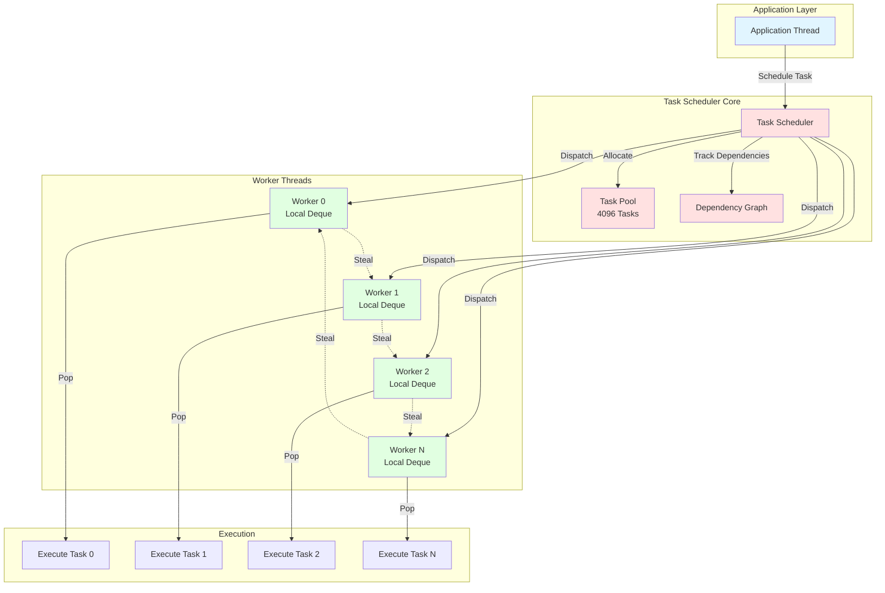
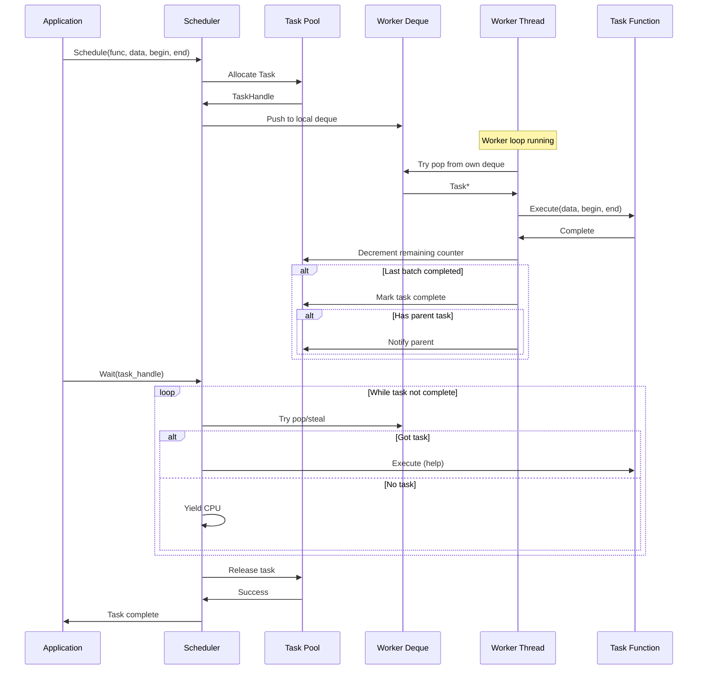
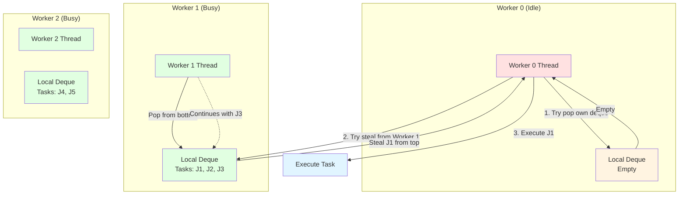
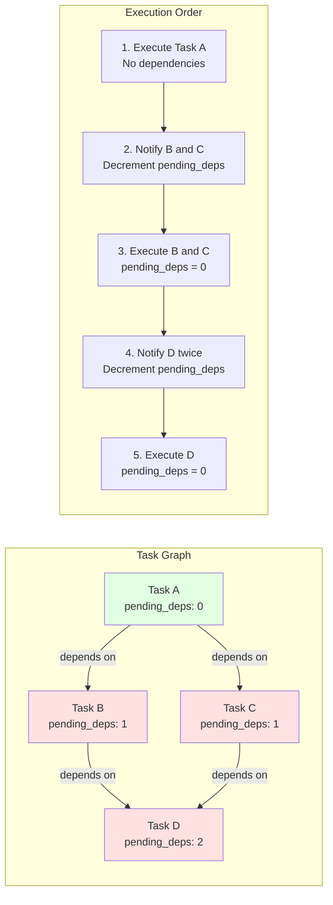

# Work-Stealing Task Scheduler Design

## Overview

This document outlines a **custom, minimal-dependency task scheduler** with work-stealing, fiber-based task continuations, and lock-free synchronization. These patterns enable building high-performance parallel execution without relying on external threading libraries.

## Architecture Overview



## Task Lifecycle Flow



## Work-Stealing Flow



## Dependency Graph Flow



## Core Philosophy

1. **Work-Stealing**: Idle workers steal tasks from busy workers' queues
2. **Cache-Friendly**: Thread-local task queues to minimize contention
3. **Fiber-Based Continuations**: Suspend/resume tasks without blocking threads
4. **Dependency Tracking**: DAG-based task dependencies with automatic scheduling
5. **Bounded Overhead**: Fixed-size task structures, no dynamic allocations in hot paths
6. **NUMA-Aware**: Pin workers to cores and allocate memory on correct NUMA nodes

## Task Structure

### Minimal Task Descriptor

```cpp
// task.h
#pragma once

namespace astral {

// Task function signature
using TaskFunction = void (*)(void* data, uint32_t begin, uint32_t end);

// Task descriptor (128 bytes, cache-line aligned)
struct alignas(128) Task {
  TaskFunction   func;           // Function to execute
  void*         data;           // User data pointer
  Atomic32      remaining;      // Remaining work items
  uint32_t      begin;          // Start index
  uint32_t      end;            // End index (exclusive)
  uint32_t      batch_size;     // Items per batch
  Task*          parent;         // Parent task (for dependency chaining)
  uint32_t      priority;       // Priority level (0 = highest)
  uint32_t      worker_affinity;// Preferred worker (-1 = any)
};
// Task must be trivially copyable for efficient work-stealing operations
// This enables fast copying between deques without constructors/destructors
static_assert(std::is_trivially_copyable_v<Task>,
              "Task must be trivially copyable for work-stealing scheduler");

// Task handle (returned to user)
struct TaskHandle {
  Task*     task;
  uint32_t generation;  // To detect stale handles
};

} // namespace astral
```

### Task Pool

```cpp
// task_pool.h
#pragma once

namespace astral {

// Fixed-size task pool with generation counters
class TaskPool {
public:
  static constexpr uint32_t MAX_TASKS = 4096;

  TaskPool() {
    for (uint32_t i = 0; i < MAX_TASKS; ++i) {
      tasks_[i].remaining.store(0, MemoryOrder::Relaxed);
      generations_[i].store(0, MemoryOrder::Relaxed);
      free_list_[i].store(i + 1, MemoryOrder::Relaxed);
    }
    free_list_[MAX_TASKS - 1].store(UINT32_MAX, MemoryOrder::Relaxed);
    free_head_.store(0, MemoryOrder::Relaxed);
  }

  TaskHandle allocate() {
    // v0.1 constraint: avoid atomic compare-and-swap.
    // Implementation sketch: protect the freelist with a tiny spinlock (atomic_flag).
    lock_();
    const uint32_t index = free_head_.load(MemoryOrder::Relaxed);
    if (index == UINT32_MAX) {
      unlock_();
      return TaskHandle{ nullptr, 0 };  // Pool exhausted
    }

    const uint32_t next = free_list_[index].load(MemoryOrder::Relaxed);
    free_head_.store(next, MemoryOrder::Relaxed);
    const uint32_t gen = generations_[index].fetch_add(1, MemoryOrder::Relaxed);
    unlock_();
    return TaskHandle{ &tasks_[index], gen };
  }

  void release(TaskHandle handle) {
    if (!handle.task) return;

    const uint32_t index = static_cast<uint32_t>(handle.task - tasks_);

    lock_();
    const uint32_t head = free_head_.load(MemoryOrder::Relaxed);
    free_list_[index].store(head, MemoryOrder::Relaxed);
    free_head_.store(index, MemoryOrder::Release);
    unlock_();
  }

  bool is_valid(TaskHandle handle) const {
    if (!handle.task) return false;
    uint32_t index = static_cast<uint32_t>(handle.task - tasks_);
    return generations_[index].load(MemoryOrder::Acquire) == handle.generation;
  }

private:
  Task tasks_[MAX_TASKS];
  Atomic32 generations_[MAX_TASKS];
  Atomic32 free_list_[MAX_TASKS];
  Atomic32 free_head_;
};

} // namespace astral
```

## Work-Stealing Deque

### Chase-Lev Work-Stealing Deque

```cpp
// work_stealing_deque.h
#pragma once

namespace astral {

// Lock-free work-stealing deque (Chase-Lev algorithm)
template<typename T>
class WorkStealingDeque {
public:
  static constexpr size_t CAPACITY = 4096;

  WorkStealingDeque()
    : buffer_(new T[CAPACITY])
    , mask_(CAPACITY - 1)
  {
    top_.store(0, MemoryOrder::Relaxed);
    bottom_.store(0, MemoryOrder::Relaxed);
  }

  ~WorkStealingDeque() {
    delete[] buffer_;
  }

  // Push to bottom (owner thread only)
  // ASTRAL_FORCE_INLINE defined in LOW_LEVEL_PRIMITIVES.md:227-241
  // Why: Called in tight loop during task submission (5-10% speedup)
  ASTRAL_FORCE_INLINE bool push(const T& item) {
    int64_t b = bottom_.load(MemoryOrder::Relaxed);
    int64_t t = top_.load(MemoryOrder::Acquire);

    if (b - t >= CAPACITY) {
      return false;  // Deque full
    }

    buffer_[b & mask_] = item;
    bottom_.store(b + 1, MemoryOrder::Release);
    return true;
  }

  // Pop from bottom (owner thread only)
  // ASTRAL_FORCE_INLINE for hot-path task retrieval (5-10% speedup)
  ASTRAL_FORCE_INLINE bool pop(T& item) {
    // NOTE: lock-free Chase-Lev uses atomic compare-and-swap; v0.1 avoids it.
    // If we implement work stealing under this constraint, we either:
    // - use a tiny spinlock around deque operations, or
    // - switch to per-worker rings + a global MPMC fallback.
    lock_();
    const int64_t b = bottom_.load(MemoryOrder::Relaxed);
    const int64_t t = top_.load(MemoryOrder::Relaxed);
    if (t >= b) {
      unlock_();
      return false;
    }
    const int64_t new_b = b - 1;
    item = buffer_[new_b & mask_];
    bottom_.store(new_b, MemoryOrder::Release);
    unlock_();
    return true;
  }

  // Steal from top (any thread)
  // ASTRAL_FORCE_INLINE for hot-path work stealing (5-10% speedup)
  ASTRAL_FORCE_INLINE bool steal(T& item) {
    lock_();
    const int64_t t = top_.load(MemoryOrder::Relaxed);
    const int64_t b = bottom_.load(MemoryOrder::Relaxed);
    if (t >= b) {
      unlock_();
      return false;
    }
    item = buffer_[t & mask_];
    top_.store(t + 1, MemoryOrder::Release);
    unlock_();
    return true;
  }

  size_t size() const {
    int64_t b = bottom_.load(MemoryOrder::Relaxed);
    int64_t t = top_.load(MemoryOrder::Relaxed);
    return (b >= t) ? (b - t) : 0;
  }

private:
  T* buffer_;
  size_t mask_;
  Atomic64 top_;     // Steal from here (multiple threads)
  Atomic64 bottom_;  // Push/pop here (owner thread only)
};

} // namespace astral
```

## Task Scheduler

### Core Scheduler Implementation

```cpp
// task_scheduler.h
#pragma once

namespace astral {

class TaskScheduler {
public:
  TaskScheduler(uint32_t num_workers, uint32_t* worker_affinity = nullptr)
    : num_workers_(num_workers)
    , workers_(new WorkerContext[num_workers])
    , threads_(new std::thread[num_workers])
  {
    for (uint32_t i = 0; i < num_workers; ++i) {
      workers_[i].id = i;
      workers_[i].scheduler = this;

      // Launch worker thread
      threads_[i] = std::thread(&TaskScheduler::worker_loop, this, i);

      // Set affinity if specified
      if (worker_affinity) {
        set_thread_affinity(threads_[i], worker_affinity[i]);
      }
    }
  }

  ~TaskScheduler() {
    // Signal shutdown
    shutdown_.store(true, MemoryOrder::Release);

    // Join all workers
    for (uint32_t i = 0; i < num_workers_; ++i) {
      threads_[i].join();
    }

    delete[] threads_;
    delete[] workers_;
  }

  // Schedule a task
  TaskHandle schedule(TaskFunction func, void* data,
                     uint32_t begin, uint32_t end,
                     uint32_t batch_size = 1,
                     Task* parent = nullptr) {
    TaskHandle handle = task_pool_.allocate();
    if (!handle.task) return handle;  // Pool exhausted

    Task* task = handle.task;
    task->func = func;
    task->data = data;
    task->begin = begin;
    task->end = end;
    task->batch_size = batch_size;
    task->parent = parent;
    task->priority = 0;
    task->worker_affinity = UINT32_MAX;

    uint32_t total_items = end - begin;
    uint32_t num_batches = (total_items + batch_size - 1) / batch_size;
    task->remaining.store(num_batches, MemoryOrder::Release);

    // Push to local deque or random worker's deque
    uint32_t worker_id = get_current_worker_id();
    if (worker_id == UINT32_MAX) {
      worker_id = rand() % num_workers_;
    }

    workers_[worker_id].deque.push(task);

    return handle;
  }

  // Wait for task completion
  void wait(TaskHandle handle) {
    if (!task_pool_.is_valid(handle)) return;

    // Help execute tasks while waiting
    while (handle.task->remaining.load(MemoryOrder::Acquire) > 0) {
      Task* task = nullptr;
      uint32_t worker_id = get_current_worker_id();

      if (worker_id != UINT32_MAX) {
        // Try to pop from own deque
        if (workers_[worker_id].deque.pop(task)) {
          execute_task(task);
          continue;
        }
      }

      // Try to steal from others
      if (try_steal_task(task)) {
        execute_task(task);
      } else {
        // No work; yield
        arch::cpu_pause();
      }
    }

    task_pool_.release(handle);
  }

private:
  struct WorkerContext {
    uint32_t id;
    TaskScheduler* scheduler;
    WorkStealingDeque<Task*> deque;
    uint8_t padding[CACHE_LINE_SIZE - sizeof(uint32_t) - sizeof(void*) - sizeof(WorkStealingDeque<Task*>)];
  };

  uint32_t num_workers_;
  WorkerContext* workers_;
  std::thread* threads_;
  TaskPool task_pool_;
  Atomic32 shutdown_{0};

  // Thread-local storage for worker ID
  static thread_local uint32_t tls_worker_id_;

  uint32_t get_current_worker_id() const {
    return tls_worker_id_;
  }

  void worker_loop(uint32_t worker_id) {
    tls_worker_id_ = worker_id;
    WorkerContext& ctx = workers_[worker_id];

    while (!shutdown_.load(MemoryOrder::Acquire)) {
      Task* task = nullptr;

      // Try to pop from own deque
      if (ctx.deque.pop(task)) {
        execute_task(task);
        continue;
      }

      // Try to steal from others
      if (try_steal_task(task)) {
        execute_task(task);
        continue;
      }

      // No work; yield CPU
      std::this_thread::yield();
    }
  }

  // ASTRAL_FORCE_INLINE for hot-path work stealing in scheduler
  ASTRAL_FORCE_INLINE bool try_steal_task(Task*& task) {
    uint32_t worker_id = get_current_worker_id();
    if (worker_id == UINT32_MAX) return false;

    // Try to steal from other workers (random order)
    for (uint32_t i = 1; i < num_workers_; ++i) {
      uint32_t victim_id = (worker_id + i) % num_workers_;
      if (workers_[victim_id].deque.steal(task)) {
        return true;
      }
    }

    return false;
  }

  // ASTRAL_FORCE_INLINE for hot-path task execution
  ASTRAL_FORCE_INLINE void execute_task(Task* task) {
    // Execute one batch of the task
    uint32_t remaining = task->remaining.fetch_sub(1, MemoryOrder::AcqRel);
    uint32_t batch_index = remaining - 1;

    uint32_t batch_begin = task->begin + batch_index * task->batch_size;
    uint32_t batch_end = batch_begin + task->batch_size;
    if (batch_end > task->end) batch_end = task->end;

    // Execute user function
    task->func(task->data, batch_begin, batch_end);

    // Check if this was the last batch
    if (remaining == 1) {
      // Task completed; notify parent if any
      if (task->parent) {
        uint32_t parent_remaining = task->parent->remaining.fetch_sub(1, MemoryOrder::AcqRel);
        if (parent_remaining == 1) {
          // Parent also completed; could schedule dependent tasks here
        }
      }
    }
  }

  void set_thread_affinity(std::thread& thread, uint32_t core_id) {
    #if ASTRAL_OS_LINUX
      cpu_set_t cpuset;
      CPU_ZERO(&cpuset);
      CPU_SET(core_id, &cpuset);
      ::pthread_setaffinity_np(thread.native_handle(), sizeof(cpu_set_t), &cpuset);
    #elif ASTRAL_OS_WINDOWS
      ::SetThreadAffinityMask(thread.native_handle(), 1ULL << core_id);
    #elif ASTRAL_OS_MACOS
      thread_port_t mach_thread = ::pthread_mach_thread_np(thread.native_handle());
      thread_affinity_policy_data_t policy = { static_cast<integer_t>(core_id) };
      ::thread_policy_set(mach_thread, THREAD_AFFINITY_POLICY,
                          (thread_policy_t)&policy, 1);
    #endif
  }
};

thread_local uint32_t TaskScheduler::tls_worker_id_ = UINT32_MAX;

} // namespace astral
```

## Task Dependencies

### DAG-Based Dependency Tracking

```cpp
// task_dependency.h
#pragma once

namespace astral {

// Task dependency graph node
struct TaskNode {
  Task* task;
  Atomic32 pending_dependencies;  // Count of dependencies not yet completed
  TaskNode** dependents;      // Tasks that depend on this one
  uint32_t num_dependents;
  uint32_t max_dependents;
};

// Task graph for dependency management
class TaskGraph {
public:
  static constexpr uint32_t MAX_GRAPH_NODES = 4096;
  static constexpr uint32_t MAX_DEPENDENTS_PER_NODE = 16;

  TaskGraph() {
    for (uint32_t i = 0; i < MAX_GRAPH_NODES; ++i) {
      nodes_[i].dependents = new TaskNode*[MAX_DEPENDENTS_PER_NODE];
      nodes_[i].max_dependents = MAX_DEPENDENTS_PER_NODE;
      free_list_[i] = i + 1;
    }
    free_list_[MAX_GRAPH_NODES - 1] = UINT32_MAX;
    free_head_ = 0;
  }

  ~TaskGraph() {
    for (uint32_t i = 0; i < MAX_GRAPH_NODES; ++i) {
      delete[] nodes_[i].dependents;
    }
  }

  // Add a dependency: 'dependent' depends on 'dependency'
  void add_dependency(Task* dependent, Task* dependency) {
    TaskNode* dep_node = find_or_create_node(dependency);
    TaskNode* dependent_node = find_or_create_node(dependent);

    // Increment pending dependencies for dependent
    dependent_node->pending_dependencies.fetch_add(1, MemoryOrder::Relaxed);

    // Add dependent to dependency's list
    uint32_t idx = dep_node->num_dependents++;
    if (idx < dep_node->max_dependents) {
      dep_node->dependents[idx] = dependent_node;
    }
  }

  // Notify that a task has completed
  void notify_completed(Task* task) {
    TaskNode* node = find_node(task);
    if (!node) return;

    // Notify all dependents
    for (uint32_t i = 0; i < node->num_dependents; ++i) {
      TaskNode* dependent = node->dependents[i];
      uint32_t remaining = dependent->pending_dependencies.fetch_sub(1, MemoryOrder::AcqRel);

      if (remaining == 1) {
        // All dependencies satisfied; task can now be scheduled
        // (Schedule task to worker deque here)
      }
    }

    // Release node back to pool
    release_node(node);
  }

private:
  TaskNode nodes_[MAX_GRAPH_NODES];
  uint32_t free_list_[MAX_GRAPH_NODES];
  uint32_t free_head_;

  TaskNode* find_or_create_node(Task* task) {
    // Linear search (could use hash table for larger graphs)
    for (uint32_t i = 0; i < MAX_GRAPH_NODES; ++i) {
      if (nodes_[i].task == task) {
        return &nodes_[i];
      }
    }

    // Allocate new node
    uint32_t index = free_head_;
    if (index == UINT32_MAX) return nullptr;

    free_head_ = free_list_[index];
    nodes_[index].task = task;
    nodes_[index].pending_dependencies.store(0, MemoryOrder::Relaxed);
    nodes_[index].num_dependents = 0;

    return &nodes_[index];
  }

  TaskNode* find_node(Task* task) {
    for (uint32_t i = 0; i < MAX_GRAPH_NODES; ++i) {
      if (nodes_[i].task == task) {
        return &nodes_[i];
      }
    }
    return nullptr;
  }

  void release_node(TaskNode* node) {
    uint32_t index = static_cast<uint32_t>(node - nodes_);
    node->task = nullptr;
    node->num_dependents = 0;
    free_list_[index] = free_head_;
    free_head_ = index;
  }
};

} // namespace astral
```

## Fiber-Based Task Continuations

### Lightweight Fiber Implementation

```cpp
// fiber.h
#pragma once

namespace astral {

// Fiber context (platform-specific)
#if ASTRAL_ARCH_X64

struct FiberContext {
  void* rsp;  // Stack pointer
  void* rbp;  // Base pointer
  void* r12;
  void* r13;
  void* r14;
  void* r15;
  void* rbx;
  void* rip;  // Instruction pointer
};

// Switch to fiber (x86-64 System V ABI)
extern "C" void fiber_switch(FiberContext* from, FiberContext* to);

asm(
  ".globl fiber_switch\n"
  "fiber_switch:\n"
  // Save current context to 'from'
  "  movq %rsp, 0(%rdi)\n"
  "  movq %rbp, 8(%rdi)\n"
  "  movq %r12, 16(%rdi)\n"
  "  movq %r13, 24(%rdi)\n"
  "  movq %r14, 32(%rdi)\n"
  "  movq %r15, 40(%rdi)\n"
  "  movq %rbx, 48(%rdi)\n"
  "  movq (%rsp), %rax\n"  // Return address
  "  movq %rax, 56(%rdi)\n"
  // Restore context from 'to'
  "  movq 0(%rsi), %rsp\n"
  "  movq 8(%rsi), %rbp\n"
  "  movq 16(%rsi), %r12\n"
  "  movq 24(%rsi), %r13\n"
  "  movq 32(%rsi), %r14\n"
  "  movq 40(%rsi), %r15\n"
  "  movq 48(%rsi), %rbx\n"
  "  movq 56(%rsi), %rax\n"
  "  jmpq *%rax\n"
);

#elif ASTRAL_ARCH_ARM64

struct FiberContext {
  void* sp;   // Stack pointer
  void* x19;
  void* x20;
  void* x21;
  void* x22;
  void* x23;
  void* x24;
  void* x25;
  void* x26;
  void* x27;
  void* x28;
  void* fp;   // Frame pointer (x29)
  void* lr;   // Link register (x30)
};

extern "C" void fiber_switch(FiberContext* from, FiberContext* to);

asm(
  ".globl fiber_switch\n"
  "fiber_switch:\n"
  // Save current context to 'from'
  "  mov x9, sp\n"
  "  stp x9, x19, [x0, #0]\n"
  "  stp x20, x21, [x0, #16]\n"
  "  stp x22, x23, [x0, #32]\n"
  "  stp x24, x25, [x0, #48]\n"
  "  stp x26, x27, [x0, #64]\n"
  "  stp x28, x29, [x0, #80]\n"
  "  str x30, [x0, #96]\n"
  // Restore context from 'to'
  "  ldp x9, x19, [x1, #0]\n"
  "  mov sp, x9\n"
  "  ldp x20, x21, [x1, #16]\n"
  "  ldp x22, x23, [x1, #32]\n"
  "  ldp x24, x25, [x1, #48]\n"
  "  ldp x26, x27, [x1, #64]\n"
  "  ldp x28, x29, [x1, #80]\n"
  "  ldr x30, [x1, #96]\n"
  "  ret\n"
);

#endif

// Fiber with separate stack
struct Fiber {
  FiberContext context;
  void* stack;
  size_t stack_size;

  Fiber(void (*entry_point)(void*), void* arg, size_t stack_sz = 64 * 1024)
    : stack_size(stack_sz)
  {
    // Allocate stack
    stack = aligned_alloc(16, stack_size);

    // Initialize stack with entry point
    void** stack_top = reinterpret_cast<void**>(
      static_cast<uint8_t*>(stack) + stack_size
    );

    #if ASTRAL_ARCH_X64
      stack_top[-1] = reinterpret_cast<void*>(entry_point);
      stack_top[-2] = arg;
      context.rsp = &stack_top[-2];
      context.rip = reinterpret_cast<void*>(entry_point);
    #elif ASTRAL_ARCH_ARM64
      stack_top[-1] = arg;
      context.sp = &stack_top[-1];
      context.lr = reinterpret_cast<void*>(entry_point);
    #endif
  }

  ~Fiber() {
    free(stack);
  }
};

// Yield from current fiber to another
inline void fiber_yield(FiberContext* current, FiberContext* target) {
  fiber_switch(current, target);
}

} // namespace astral
```

### Task Continuation Pattern

```cpp
// task_continuation.h
#pragma once

namespace astral {

// Task that can suspend and resume
struct ContinuableTask {
  TaskFunction func;
  void* data;
  FiberContext fiber_ctx;
  FiberContext* return_ctx;  // Where to return when yielding
  bool completed;
};

// Yield current task (suspend execution)
void task_yield(TaskScheduler* scheduler, ContinuableTask* task) {
  // Switch back to scheduler's context
  fiber_yield(&task->fiber_ctx, task->return_ctx);
}

// Resume a suspended task
void task_resume(TaskScheduler* scheduler, ContinuableTask* task, FiberContext* return_to) {
  task->return_ctx = return_to;
  fiber_yield(return_to, &task->fiber_ctx);
}

} // namespace astral
```

## Advanced Patterns

### Priority Scheduling

```cpp
// priority_scheduler.h
#pragma once

namespace astral {

// Priority-aware task scheduler
class PriorityTaskScheduler {
public:
  static constexpr uint32_t NUM_PRIORITIES = 4;

  struct WorkerContext {
    uint32_t id;
    WorkStealingDeque<Task*> deques[NUM_PRIORITIES];  // One per priority
  };

  void schedule(Task* task) {
    uint32_t priority = task->priority;
    if (priority >= NUM_PRIORITIES) priority = NUM_PRIORITIES - 1;

    uint32_t worker_id = get_worker_for_task(task);
    workers_[worker_id].deques[priority].push(task);
  }

private:
  WorkerContext* workers_;

  Task* try_pop_priority(WorkerContext& ctx) {
    // Try highest priority first
    for (uint32_t p = 0; p < NUM_PRIORITIES; ++p) {
      Task* task = nullptr;
      if (ctx.deques[p].pop(task)) {
        return task;
      }
    }
    return nullptr;
  }

  Task* try_steal_priority(uint32_t worker_id) {
    // Steal from highest priority queues first
    for (uint32_t p = 0; p < NUM_PRIORITIES; ++p) {
      for (uint32_t i = 1; i < num_workers_; ++i) {
        uint32_t victim_id = (worker_id + i) % num_workers_;
        Task* task = nullptr;
        if (workers_[victim_id].deques[p].steal(task)) {
          return task;
        }
      }
    }
    return nullptr;
  }
};

} // namespace astral
```

### Parallel-For Pattern

```cpp
// parallel_for.h
#pragma once

namespace astral {

// Execute function over range [begin, end) in parallel
template<typename Func>
TaskHandle parallel_for(TaskScheduler& scheduler,
                       uint32_t begin, uint32_t end,
                       uint32_t batch_size,
                       Func&& func) {
  struct ParallelForData {
    Func func;
  };

  ParallelForData* data = new ParallelForData{ std::forward<Func>(func) };

  auto wrapper = [](void* user_data, uint32_t b, uint32_t e) {
    ParallelForData* pf_data = static_cast<ParallelForData*>(user_data);
    for (uint32_t i = b; i < e; ++i) {
      pf_data->func(i);
    }
  };

  return scheduler.schedule(wrapper, data, begin, end, batch_size);
}

// Example usage
void example_parallel_for(TaskScheduler& scheduler) {
  float* data = new float[10000];

  TaskHandle task = parallel_for(scheduler, 0, 10000, 256,
    [data](uint32_t i) {
      data[i] = i * 2.0f;
    }
  );

  scheduler.wait(task);
  delete[] data;
}

} // namespace astral
```

## Performance Optimization Tricks

### 1. Cache-Line Padding

```cpp
// Prevent false sharing between worker contexts
struct alignas(128) WorkerContext {
  uint32_t id;
  WorkStealingDeque<Task*> deque;
  uint8_t padding[64 - sizeof(uint32_t) - sizeof(WorkStealingDeque<Task*>)];
};
```

### 2. Batch Stealing

```cpp
// Steal multiple tasks at once to reduce contention
bool batch_steal(WorkStealingDeque<Task*>& victim, Task** tasks, uint32_t max_steal) {
  uint32_t stolen = 0;
  for (uint32_t i = 0; i < max_steal; ++i) {
    if (!victim.steal(tasks[stolen])) break;
    stolen++;
  }
  return stolen > 0;
}
```

### 3. Adaptive Spinning

```cpp
// Spin for a while before yielding CPU
void adaptive_wait(Atomic32& condition, uint32_t max_spins = 1000) {
  for (uint32_t i = 0; i < max_spins; ++i) {
    if (condition.load(MemoryOrder::Acquire) == 0) return;
    arch::cpu_pause();
  }
  std::this_thread::yield();
}
```

### 4. NUMA-Aware Task Placement

```cpp
// Place tasks on workers closest to data
uint32_t get_numa_node_for_pointer(void* ptr) {
  #if ASTRAL_OS_LINUX
    int numa_node = -1;
    ::get_mempolicy(&numa_node, nullptr, 0, ptr, MPOL_F_NODE | MPOL_F_ADDR);
    return (numa_node >= 0) ? numa_node : 0;
  #else
    return 0;  // Fallback to node 0
  #endif
}

uint32_t get_worker_for_data(void* data, uint32_t* worker_to_numa) {
  uint32_t numa_node = get_numa_node_for_pointer(data);
  // Find first worker on this NUMA node
  for (uint32_t i = 0; i < num_workers_; ++i) {
    if (worker_to_numa[i] == numa_node) {
      return i;
    }
  }
  return 0;
}
```

## Best Practices Summary

1. **Work-Stealing**: Use Chase-Lev deques for efficient lock-free work distribution
2. **Cache-Line Padding**: Pad worker contexts to 64 bytes to prevent false sharing
3. **Priority Scheduling**: Use multiple priority queues per worker for important tasks
4. **Fiber Continuations**: Use fibers for tasks that need to suspend/resume (e.g., I/O waits)
5. **NUMA-Aware**: Pin workers to cores and place tasks near data
6. **Batch Operations**: Steal/execute multiple tasks at once to reduce overhead
7. **Adaptive Spinning**: Spin briefly before yielding to reduce context switches
8. **Dependency Tracking**: Use DAG-based dependency graphs for complex task chains
9. **Minimal Allocations**: Use object pools for tasks; no malloc in hot paths
10. **Testing**: Validate with ThreadSanitizer and stress tests under high contention
